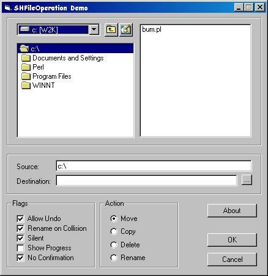



## SHFileOperation Demo

### Description

This is a simple demo of using the API to manage files. It demonstrates the use of SHFileOperation. It is by no means a 'File Manager'. It was put together in order to answer questions from many coders new to 'VB in the Discussion Forum. I hope it is of some help to those folks.
 
### More Info
 

             |
---                |---
**Submitted On**   |2002-09-14 07:36:02
**By**             |[MrBobo](https://github.com/Planet-Source-Code/PSCIndex/blob/master/ByAuthor/mrbobo.md)
**Level**          |Beginner
**User Rating**    |4.7 (28 globes from 6 users)
**Compatibility**  |VB 6\.0
**Category**       |[Windows API Call/ Explanation](https://github.com/Planet-Source-Code/PSCIndex/blob/master/ByCategory/windows-api-call-explanation__1-39.md)
**World**          |[Visual Basic](https://github.com/Planet-Source-Code/PSCIndex/blob/master/ByWorld/visual-basic.md)
**Archive File**   |[SHFileOper1310459142002\.zip](https://github.com/Planet-Source-Code/mrbobo-shfileoperation-demo__1-38982/archive/master.zip)

